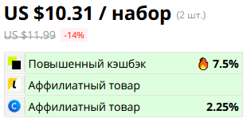

# AliExpress Affiliate Checker
Скрипт для проверки аффилиатности товаров на AliExpress.
Вверху скрипта есть секция с настройками, которые можно настроить под себя.

Под ценой товара добавляется таблица примерно такого вида:  

При нажатии на иконку сервиса произойдет переход по кэшбечной ссылке. Для генерации ссылки нужен хеш юзера от конкретного сервиса. Их можно посмотреть в F12, если создавать ссылку вручную с сайта сервиса. Хэшы добавлять в секцию с настройками.

По умолчанию скрипт проверяет товар при клике по цене, но можно включить автоматическую проверку при открытии страницы товара.

## Установка
1. Установить одно из браузерных расширений для выполнения пользовательских скриптов.  
   Tampermonkey: [Chrome](https://chrome.google.com/webstore/detail/tampermonkey/dhdgffkkebhmkfjojejmpbldmpobfkfo?hl=ru), [Firefox](https://addons.mozilla.org/ru/firefox/addon/tampermonkey/), [Opera](https://addons.opera.com/ru/extensions/details/tampermonkey-beta/)  
   Violentmonkey: [Chrome](https://chrome.google.com/webstore/detail/violentmonkey/jinjaccalgkegednnccohejagnlnfdag?hl=ru), [Firefox](https://addons.mozilla.org/ru/firefox/addon/violentmonkey/), [Maxthon](https://extension.maxthon.com/detail/index.php?view_id=1680)  
   Greasemonkey: [Firefox](https://addons.mozilla.org/ru/firefox/addon/greasemonkey/)
2. Перейти [сюда](/../../raw/master/AliExpressAffiliateChecker.user.js).
3. Подтвердить установку скрипта.
